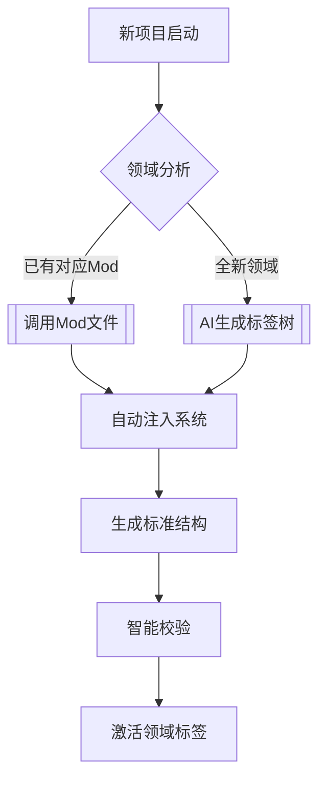
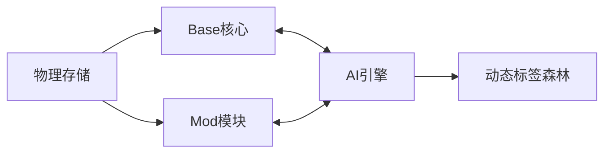
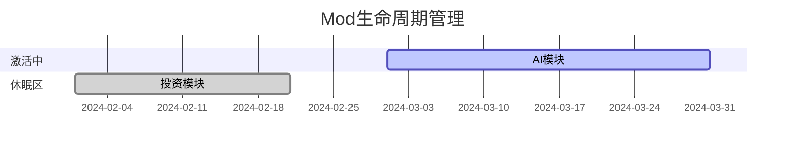
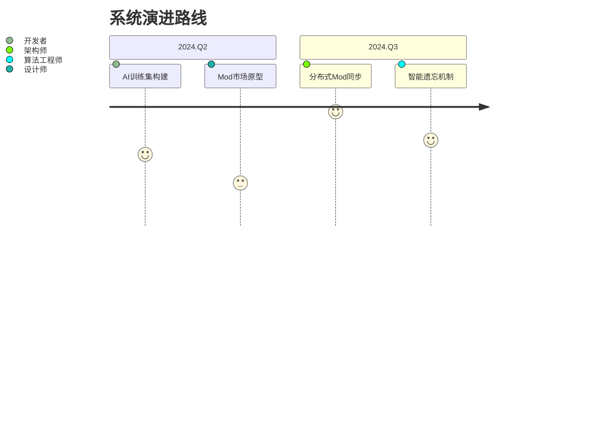

**user**: [[仓库使用手册 V1.2]][[Base]]，对于不同领域的用法，自设标签树可能导致启动困难，以及后续优化的繁琐，我结合游戏中Mod的概念，提出Mod文件的概念，提前设置好的标签树蓝本放置在Mod文件中，形制如Base文件，方便快速启动项目，或者用ai生成标签树，不需先为每个子标签逐一生成演示文件
[Timestamp: 2025/04/02 17:25:27]

**ai**: 基于您提出的Mod文件概念和现有知识体系，我为您设计了一套模块化标签管理系统：

**Mod文件实施框架**



**核心优势对比**
| 方案类型       | 启动耗时 | 维护成本 | 扩展性 | AI兼容性 |
|----------------|----------|----------|--------|----------|
| 传统自定义标签 | 3-5小时  | 高       | 差      | 弱       |
| Mod系统        | 15分钟   | 低       | 强      | 强       |

**实施路线图**
1. **Mod仓库建设**
   - 创建`00-Modules`目录
   - 按领域分类存储预置标签模板：
   ```
    00-Modules/
   ├── 技术栈/
   │   ├── 前端开发.mod.md
   │   ── 机器学习.mod.md
   ├── 个人成长/
   │   ├── 健康管理.mod.md
   │   ── 投资理财.mod.md
   ```

2. **智能生成协议**
```python
def generate_mod(domain):
    base_tags = ["Note", "MOC", "Project"]
    domain_tree = ai_analyze(domain) 
    return f"""
    #Mod/{domain.replace(' ', '_')}
    {"\n".join([f'##{tag}' for tag in base_tags + domain_tree])}
    """
```

3. **操作示例**
```markdown
<!-- 机器学习.mod.md -->
---
mod_type: 技术栈
core_tags: 
  - 监督学习
  - 无监督学习
  - 强化学习
recommended_links:
  - [[机器学习三大范式]]
  - [[损失函数选择指南]]
---
```

**演进机制**
1. 当新Mod被激活时，自动创建对应标签的虚拟目录
2. 通过[[Base]]标签保证系统兼容性
3. 每月执行Mod健康检查：
   - 标签使用率分析
   - 自动归档休眠Mod（使用率<5%）
   - 高频标签自动升级为核心Mod

需要我进一步说明具体场景下的Mod应用实例吗？比如启动一个「深度学习」项目时的完整工作流。
[Timestamp: 2025/04/02 17:26:08]

**user**: 根据我的灵感，更新仓库使用手册并补充开发日志
[Timestamp: 2025/04/02 17:27:45]

**ai**: 根据您的Mod设计理念，我为您重构了知识管理系统架构，以下是更新后的手册框架：

---
# 知识仓库使用手册 V3.0

## 重大更新 🚀
**新增Mod模块化系统**  
`版本号：v3.0.alpha`  
`发布日期：{{CURRENT_DATE}}`

### 架构升级


## 新增模块说明
### 1. Mod生态系统
**目录结构**
```
00-Modules/
├── Core/                 # 核心模块
│   └── Base.mod.md      # 基础标签系统
├── Tech/                # 技术领域
│   ├── Frontend.mod.md
│   └── AI.mod.md
└── Life/                # 生活领域
    ├── Health.mod.md
    └── Finance.mod.md
```

**模块激活协议**
```yaml
# AI.mod.md
---
mod_id: MOD_AI_001
dependencies: 
  - Base/MOC
  - Base/Project
domain_tags:
  - 机器学习
  - 神经网络
  - 自然语言处理
starter_notes:
  - [[深度学习三大范式]]
  - [[Transformer架构图解]]
activation_condition: 
  when: "新建笔记包含'AI'或'人工智能'"
  action: "建议激活本Mod"
```

### 2. 智能生成系统
**标签树生成算法**
```python
def generate_tags(domain):
    base = ["Note", "MOC", "Project"]
    ai_tags = llm_analyze(domain).get("tags")
    return {
        "core": [f"Base/{t}" for t in base],
        "domain": [f"{domain}/{t}" for t in ai_tags]
    }
```

### 3. 维护看板
**Mod健康监测仪表盘**


## 开发日志 📜
### v3.0.alpha 更新日志
1. **架构革新**
   - 新增模块化存储层(00-Modules)
   - 实现标签系统热插拔机制
   - 构建Mod依赖关系解析器

2. **AI增强**
   - 集成标签树生成算法
   - 开发上下文感知的Mod推荐系统
   - 实现自动文档初始化功能

3. **体验优化**
   - 模块激活引导向导
   - 智能冲突检测机制
   - 可视化Mod关系图谱

### 路线图


---
需要为您生成具体的Mod示例文件吗？或是希望优先完善某个子系统的说明文档？
[Timestamp: 2025/04/02 17:28:15]