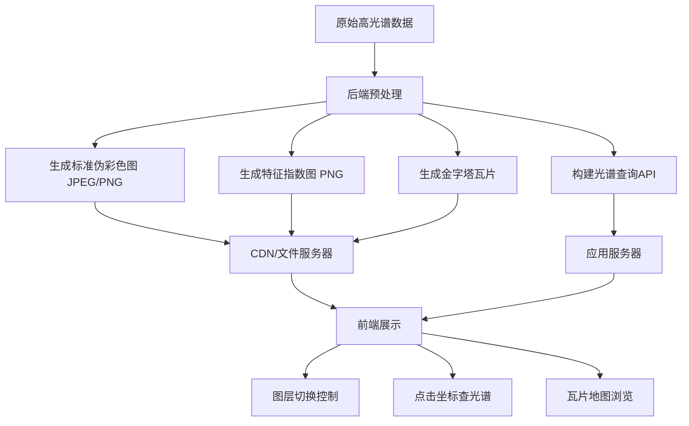

将高光谱数据在前端展示时，拆分成多份伪彩色图并通过图层切换来实现是一种**可行且常见的方案**，尤其适合对实时性要求不高、侧重结果展示的场景。但它**并非唯一方案**，具体选择需根据应用需求、数据量、交互深度和性能要求综合权衡。以下是详细分析：

---

### **方案优势：拆分为伪彩色图 + 图层切换**
1. **技术成熟 & 兼容性好：**
   - JPEG/PNG 是浏览器原生支持的通用图像格式，无需额外解码库。
   - 可直接用 `` 标签、Canvas 或 CSS 背景图加载，开发成本低。

2. **减轻前端压力：**
   - 将复杂的波段计算（PCA、指数生成、波段组合）放在**后端预处理**，前端仅负责展示。
   - 避免在前端处理庞大的三维数据立方体（可能数百 MB/GB）。

3. **交互逻辑清晰：**
   - 图层切换（如下拉菜单、缩略图列表）符合用户直觉，易于实现：
     - 预设真彩色/假彩色合成图
     - 不同特征指数图（NDVI、NDWI 等）
     - 主成分分量图（PC 1/PC 2/PC 3）
     - 特定目标增强图（如矿物、植被健康）

4. **支持基础分析：**
   - 可通过 **“比较模式”** 并排显示不同图层。
   - 叠加半透明图层（如用 Canvas 叠加遮罩）。

---

### **方案局限性及应对策略**
1. **无法实时调整波段组合：**
   - **问题：** 用户无法动态选择任意三个波段生成伪彩色图。
   - **解决：**
     - 后端预生成常用组合（如 10 种），前端切换。
     - 提供“高级模式”：允许用户选择波段号 → 向后端提交请求 → 生成新图返回（需等待）。

2. **光谱细节丢失：**
   - **问题：** 静态图片无法查看单个像素的光谱曲线。
   - **解决：**
     - **补充光谱曲线功能：** 当用户点击图片某位置时，通过 API 请求该坐标的光谱数据 → 用 ECharts/D 3. Js 绘制曲线。
     - 示例流程：
       ```js
       image.addEventListener('click', (e) => {
         const [x, y] = calculateImageCoords(e); 
         fetch(`/spectrum?x=${x}&y=${y}`)
           .then(data => plotSpectrum(data.wavelengths, data.values));
       });
       ```

3. **大文件加载慢：**
   - **问题：** 高分辨率图像（如 1000 x 1000 像素）的多个 PNG 可能体积较大。
   - **解决：**
     - 使用 **有损压缩**（JPEG 质量 80%）+ **懒加载**（仅显示当前视图所需）。
     - 生成 **多级金字塔瓦片**（如用 GDAL），适配不同缩放级别。

---

### **更高级的可选方案（需额外开发）**
| **方案**                | **适用场景**                     | **实现方式**                                                                 |
|-------------------------|----------------------------------|-----------------------------------------------------------------------------|
| **WebGL 渲染数据立方体** | 需要实时交互（如动态调整波段）   | 将整个数据立方体传至前端 → 用 Three. Js 或 WebGL 着色器实时计算 RGB 组合       |
| **动态瓦片服务**         | 大型影像在线地图                 | 使用 GeoTIFF + COG（云优化）格式，通过 IIIF 或动态瓦片服务（如 TiTiler）按需请求波段组合 |
| **WebAssembly 处理**     | 需在前端做轻量计算（如指数计算） | 用 Rust/C++ 编写算法编译为 WASM → 前端调用处理解码后的数据                     |

---

### **推荐的分层架构设计**


---

### **前端实现建议**
1. **基础展示：**
   ```html
   <div class="layer-controls">
     <select id="layer-select">
       <option value="rgb">真彩色合成</option>
       <option value="nir">近红外-红-绿假彩色</option>
       <option value="ndvi">NDVI 植被指数</option>
     </select>
   </div>
   <div class="image-container">
     
   </div>
   ```
   ```js
   document.getElementById('layer-select').addEventListener('change', (e) => {
     document.getElementById('hs-image').src = `hyperspectral/${e.target.value}.jpg`;
   });
   ```

2. **增强交互（带光谱曲线）：**
   ```js
   const image = document.getElementById('hs-image');
   image.addEventListener('click', async (e) => {
     const rect = image.getBoundingClientRect();
     const x = Math.floor((e.clientX - rect.left) / rect.width * image.naturalWidth);
     const y = Math.floor((e.clientY - rect.top) / rect.height * image.naturalHeight);
     
     const spectrum = await fetchSpectrum(x, y); // 调用后端API
     renderSpectrumChart(spectrum); // 用 Chart.js 绘图
   });
   ```

3. **性能优化：**
   - 使用 `Web Workers` 解码图像避免卡顿。
   - 对静态图片启用 HTTP 缓存 (`Cache-Control: max-age=31536000`)。

---

### **总结**
- **简单场景：** 预生成伪彩色图 + 前端图层切换 **完全够用**（尤其适用于结果报告、教学演示）。
- **深度交互需求：** 需补充 **光谱查询功能** 或集成 **WebGL 动态渲染**。
- **大型数据：** 优先采用 **瓦片服务**（如 COG + TiTiler）避免加载卡顿。

最终选择应平衡 **开发成本**、**用户体验** 和 **数据规模**。对多数应用而言，“预处理图片 + 图层切换 + 点击查光谱”的组合是最具性价比的方案。