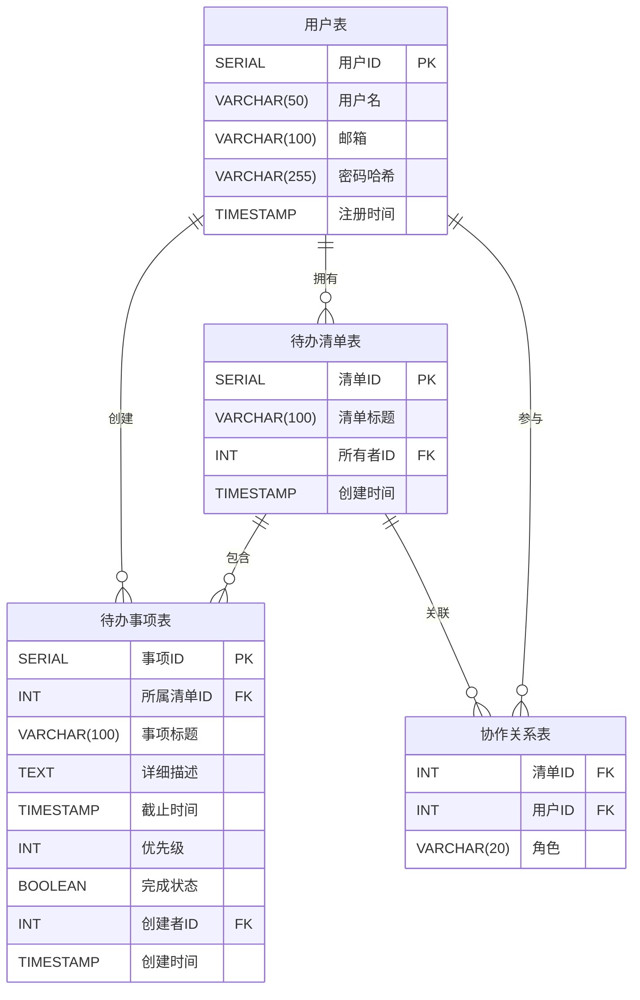

---

### **推荐项目：实时协作待办清单（To-Do List with Real-time Collaboration）**
一个允许多用户实时协同编辑和管理待办事项的系统，适合展示数据库设计、前后端交互和实时通信能力，且复杂度可控。

---

### **1. 系统功能需求**
- **用户模块**：
  - 注册/登录（邮箱或用户名+密码）。
  - 用户个人主页显示自己的待办列表。
- **待办清单模块**：
  - 创建/删除待办事项（标题、描述、截止时间、优先级）。
  - 标记任务为“完成”或“未完成”。
  - **实时协作**：多人同时编辑同一清单，操作实时同步。
- **权限管理**：
  - 创建者可邀请其他用户加入清单协作。
  - 不同用户角色（所有者、协作者）的权限控制（如仅所有者可删除清单）。
- **实时通知**：
  - 当协作者修改任务时，其他成员实时看到变化。
  - 任务截止时间提醒（可选）。

---

### **2. 技术栈建议**
| 模块          | 技术选型                         | 说明                                |
|---------------|----------------------------------|-----------------------------------|
| **前端**      | React + TypeScript              | 组件化开发，状态管理使用 Context 或 Redux。 |
| **实时通信**  | Socket. Io                       | 实现实时数据同步（如任务状态更新）。          |
| **后端**      | Node. Js + Express               | RESTful API + WebSocket 支持。      |
| **数据库**    | PostgreSQL                      | 关系型数据库，适合结构化数据存储。           |
| **部署**      | Heroku / Vercel + Supabase      | 免费托管前后端，Supabase 提供托管 PostgreSQL。 |

---

### **3. 数据库设计（关键表结构）**
#### **(1) 用户表 `users`**
| 字段名         | 类型          | 说明                     |
|----------------|---------------|------------------------|
| `id`           | SERIAL PRIMARY KEY | 用户唯一标识           |
| `username`     | VARCHAR (50)   | 用户名（唯一）          |
| `email`        | VARCHAR (100)  | 邮箱（唯一）            |
| `password_hash` | VARCHAR (255)  | 密码哈希值（BCrypt）    |
| `created_at`   | TIMESTAMP     | 注册时间               |

#### **(2) 待办清单表 `todo_lists`**
| 字段名         | 类型          | 说明                     |
|----------------|---------------|------------------------|
| `id`           | SERIAL PRIMARY KEY | 清单唯一标识           |
| `title`        | VARCHAR (100)  | 清单标题               |
| `owner_id`     | INT           | 所有者 ID（外键→ `users.id`） |
| `created_at`   | TIMESTAMP     | 创建时间               |

#### **(3) 待办事项表 `todo_items`**
| 字段名         | 类型          | 说明                     |
|----------------|---------------|------------------------|
| `id`           | SERIAL PRIMARY KEY | 事项唯一标识           |
| `list_id`      | INT           | 所属清单 ID（外键→ `todo_lists.id`） |
| `title`        | VARCHAR (100)  | 事项标题               |
| `description`  | TEXT          | 详细描述               |
| `due_date`     | TIMESTAMP     | 截止时间               |
| `priority`     | INT           | 优先级（1-低，2-中，3-高） |
| `is_completed` | BOOLEAN       | 是否完成（默认 false）   |
| `created_by`   | INT           | 创建者 ID（外键→ `users.id`） |

#### **(4) 协作关系表 `collaborations`**
| 字段名         | 类型          | 说明                     |
|----------------|---------------|------------------------|
| `list_id`      | INT           | 清单 ID（外键→ `todo_lists.id`） |
| `user_id`      | INT           | 协作者 ID（外键→ `users.id`）    |
| `role`         | VARCHAR (20)   | 角色（owner/collaborator）     |


---

### **4. 关键功能实现思路**
#### **(1) 实时协作同步**
- **前端**：使用 Socket. Io 客户端监听后端事件（如 `item-updated`）。
- **后端**：当用户修改任务时，通过 Socket. Io 广播事件给同一清单的所有在线协作者。
- **示例代码**：
  ```javascript
  // 后端（Node.js + Socket.io）
  io.on('connection', (socket) => {
    socket.on('join-list', (listId) => {
      socket.join(listId); // 加入特定清单的房间
    });

    socket.on('update-item', (item) => {
      // 更新数据库（如标记完成）
      db.updateTodoItem(item);
      // 广播给同一清单的其他用户
      socket.to(item.list_id).emit('item-updated', item);
    });
  });

#### **(2) 权限控制**
- 在用户尝试修改清单前，后端校验用户身份：
  ```javascript
  // 检查用户是否是清单的所有者或协作者
  const isAllowed = await db.checkUserPermission(userId, listId);
  if (!isAllowed) throw new Error('无权限操作');
  ```

#### **(3) 任务截止提醒（可选）**
- 使用定时任务（如 `node-schedule`）扫描 `todo_items` 表中 `due_date` 临近的任务。
- 通过 WebSocket 或邮件通知用户：
  ```javascript
  schedule.scheduleJob('0 * * * *', async () => {
    const nearingItems = await db.getItemsDueSoon();
    nearingItems.forEach(item => {
      io.to(item.user_id).emit('reminder', item);
    });
  });
  ```

---

### **5. 页面原型示例**
#### **首页（未登录）**
- 注册/登录入口。
- 展示系统功能介绍。

#### **用户主页（登录后）**
- 显示用户拥有的待办清单列表。
- 按钮：创建新清单、邀请协作者。

#### **待办清单详情页**
- 清单标题、描述、协作者列表。
- 待办事项列表：可添加、编辑、删除、标记完成。
- 实时显示其他协作者的操作（如字体颜色变化或动态图标）。

---

### **6. 扩展方向（加分项）**
- **历史记录**：记录任务修改日志（如谁在何时修改了什么）。
- **任务评论**：允许协作者对任务添加讨论。
- **拖拽排序**：前端支持拖动任务调整优先级。
- **数据导出**：将清单导出为 PDF 或 CSV。

---

### **7. 部署与展示**
- **前端**：部署到 Vercel，自动关联 GitHub 仓库。
- **后端**：部署到 Heroku，绑定自定义域名。
- **数据库**：使用 Supabase 免费托管 PostgreSQL。
- **演示**：
  1. 展示用户注册、登录流程。
  2. 创建清单并邀请协作者（输入对方邮箱）。
  3. 在不同设备上登录协作者账号，实时同步任务状态。

---

### **总结**
该系统避开了复杂的交易逻辑，专注于实时协作和基础 CRUD 操作，适合展示全栈能力。通过清晰的数据库设计和 Socket. Io 实现实时互动，技术难度适中但足够体现数据库与前后端的整合能力。如果需要进一步简化，可去掉权限管理模块，改为所有用户可编辑公开清单（类似共享白板）。


以下是使用中文表名和字段名的 Mermaid ER 图：


![[deepseek_mermaid_20250517_d3ea33.png|500 ]]
**关系说明**：
1. 用户表 → 待办清单表：`1:N`（一个用户可拥有多个清单）
2. 待办清单表 → 待办事项表：`1:N`（一个清单包含多个事项）
3. 用户表 → 协作关系表：`1:N`（一个用户可参与多个清单协作）
4. 待办清单表 → 协作关系表：`1:N`（一个清单可被多个用户协作）

---

### 使用说明
1. **直接复制代码**到 Markdown 文件
2. **支持环境**：
   - VS Code（安装 [Mermaid 插件](https://marketplace.visualstudio.com/items?itemName=bierner.markdown-mermaid)）
   - GitHub 仓库（原生支持 Mermaid 渲染）
   - 在线编辑器（如 [Mermaid Live Editor](https://mermaid-js.github.io/mermaid-live-editor/)）

### 效果预览
![ER Diagram Preview](https://mermaid.ink/img/eyJjb2RlIjoiZXJEaWFncmFtXG5cbnVzZXJzIHtcbiAgU0VSSUFMIGlkIFBLXG4gIFZBUkNIQVIoNTApIHVzZXJuYW1lXG4gIFZBUkNIQVIoMTAwKSBlbWFpbFxuICBWQVJDSEFSKDI1NSkgcGFzc3dvcmRfaGFzaFxuICBUSU1FU1RBTVAgY3JlYXRlZF9hdFxufVxuXG50b2RvX2xpc3RzIHtcbiAgU0VSSUFMIGlkIFBLXG4gIFZBUkNIQVIoMTAwKSB0aXRsZVxuICBJTlQgb3duZXJfaWQgRktcbiAgVElNRVNUQU1QIGNyZWF0ZWRfYXRcbn1cblxudG9kb19pdGVtcyB7XG4gIFNFUklBTCBpZCBQS1xuICBJTlQgbGlzdF9pZCBGS1xuICBWQVJDSEFSKDEwMCkgdGl0bGVcbiAgVEVYVCBkZXNjcmlwdGlvblxuICBUSU1FU1RBTVAgZHVlX2RhdGVcbiAgSU5UIHByaW9yaXR5XG4gIEJPT0xFQU4gaXNfY29tcGxldGVkXG4gIElOVCBjcmVhdGVkX2J5IEZLXG4gIFRJTUVTVEFNUCBjcmVhdGVkX2F0XG59XG5cbmNvbGxhYm9yYXRpb25zIHtcbiAgSU5UIGxpc3RfaWQgRktcbiAgSU5UIHVzZXJfaWQgRktcbiAgVkFSQ0hBUigyMCkgcm9sZVxufVxuXG51c2VycyB8fC0tb3sgdG9kb19saXN0cyA6IFwib3duc1wiXG51c2VycyB8fC0tb3sgdG9kb19pdGVtcyA6IFwiY3JlYXRlc1wiXG50b2RvX2xpc3RzIHx8LS1veyB0b2RvX2l0ZW1zIDogXCJjb250YWluc1wiXG50b2RvX2xpc3RzIHx8LS1veyBjb2xsYWJvcmF0aW9ucyA6IFwiaGFzXCJcbnVzZXJzIHx8LS1veyBjb2xsYWJvcmF0aW9ucyA6IFwicGFydGljaXBhdGVzXCIiLCJtZXJtYWlkIjp7InRoZW1lIjoiZGVmYXVsdCJ9fQ)