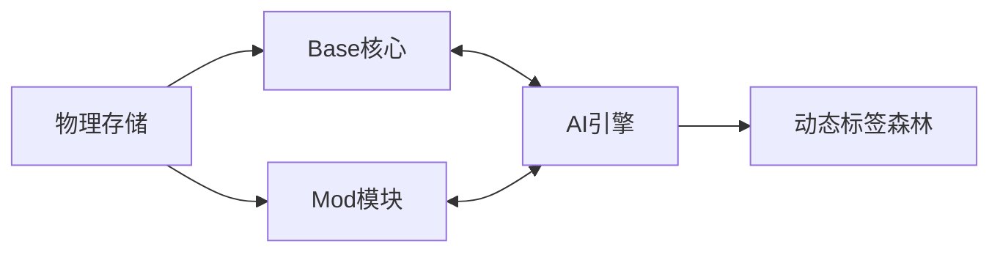
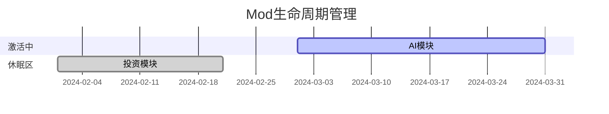
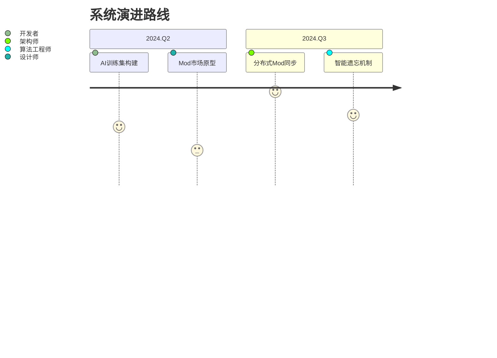

# 知识仓库使用手册 V3.0

## 重大更新 🚀
**新增Mod模块化系统**  
`版本号：v2.0.alpha`  
`发布日期：{{CURRENT_DATE}}`

### 架构升级


## 新增模块说明
### 1. Mod生态系统
**目录结构**
```
00-Modules/
├── Core/                 # 核心模块
│   └── Base.mod.md      # 基础标签系统
├── Tech/                # 技术领域
│   ├── Frontend.mod.md
│   └── AI.mod.md
└── Life/                # 生活领域
    ├── Health.mod.md
    └── Finance.mod.md
```

**模块激活协议**
```yaml
# AI.mod.md
---
mod_id: MOD_AI_001
dependencies: 
  - Base/MOC
  - Base/Project
domain_tags:
  - 机器学习
  - 神经网络
  - 自然语言处理
starter_notes:
  - [[深度学习三大范式]]
  - [[Transformer架构图解]]
activation_condition: 
  when: "新建笔记包含'AI'或'人工智能'"
  action: "建议激活本Mod"
```

### 2. 智能生成系统
**标签树生成算法**
```python
def generate_tags(domain):
    base = ["Note", "MOC", "Project"]
    ai_tags = llm_analyze(domain).get("tags")
    return {
        "core": [f"Base/{t}" for t in base],
        "domain": [f"{domain}/{t}" for t in ai_tags]
    }
```

### 3. 维护看板
**Mod健康监测仪表盘**


## 开发日志 📜
### v3.0.alpha 更新日志
1. **架构革新**
   - 新增模块化存储层(00-Modules)
   - 实现标签系统热插拔机制
   - 构建Mod依赖关系解析器

2. **AI增强**
   - 集成标签树生成算法
   - 开发上下文感知的Mod推荐系统
   - 实现自动文档初始化功能

3. **体验优化**
   - 模块激活引导向导
   - 智能冲突检测机制
   - 可视化Mod关系图谱

### 路线图

