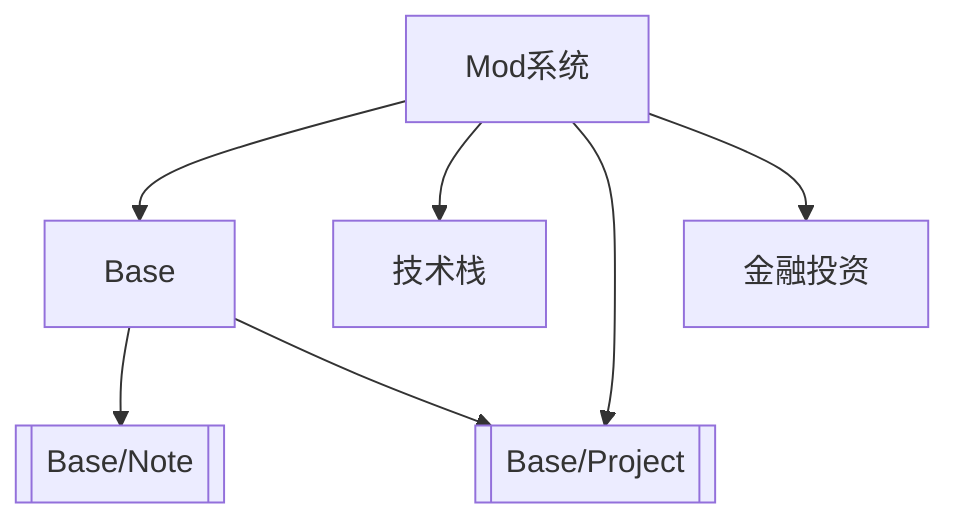
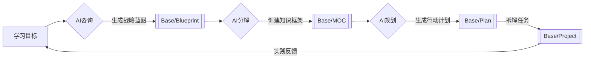

# 知识仓库使用手册 V2.2

**智能模组化知识管理系统**
## 核心升级亮点
✨ **Mod模组系统**：实现领域标签即插即用  
🤖 **AI协同架构**：支持智能生成专属标签模组  
🌲 **森林型扩展**：兼容无限领域知识分类  

---

## 核心架构
### 文件体系（物理结构）
| 目录名称         | 功能说明  | 示例内容       |
| ------------ | ----- | ---------- |
| 01-Dashboard | 个人控制台 | 技能树、年度目标   |
| 02-Nodes     | 知识数据库 | CSS盒模型详解   |
| 03-Assets    | 数字资源库 | PDF书籍、网页剪藏 |
| 04-Templates | 智能模板库 | 会议纪要模板     |
| Excalidraw   | 视觉工作区 | 系统架构图      |

### 标签体系（逻辑结构）
**Mod标签蓝图（核心框架）**


**模组仓库体系**
```text
📂 Mods/
├── Base.md        # 基础分类模组
├── 技术栈/
│   ├── 前端开发.md
│   └── 人工智能.md
├── 个人成长.md    # 健康/理财模组
└── _Template.md   # 模组创建模板
```

---

## 工作逻辑
### 信息流转路径
1. **输入**：碎片信息 → 存入Inbox  
2. **加工**：Inbox → 提炼为#Note  
3. **组织**：多个#Note → 聚合成#MOC  
4. **输出**：#MOC → 转化为#Project  
5. **归档**：完成项目 → 移入Archives  

### AI增强型学习路径
1. **规划**：学习目标 → 生成#Blueprint战略蓝图  
2. **拆解**：#Blueprint → 构建#MOC知识框架  
3. **落实**：#MOC → 创建#Plan任务清单  
4. **执行**：#Plan → 发起#Project实践项目  
5. **迭代**：#Project成果 → 反馈优化#Blueprint  
**宝宝级流程图**



**注意**：一张蓝图也许可以生成多个MOC 比如成为编程大佬，也可能直接包含行动建议 比如每日leecode
但本仓库面向笔记创建，日常任务可以加入到其他日程管理系统，或者加入自己设计的每日任务建议模块，和仪表盘链接


### 日常维护节奏

```mermaid
gantt
    title 每日维护计划
    dateFormat  HH:mm
    axisFormat %H:%M
    
    section 晨间
    清理收件箱 :a1, 07:00, 30m
    
    section 午后间隔
    间隔休息 : 12:00, 6h
    
    section 傍晚
    更新项目进度 :a2, after a1, 45m
    
    section 晚间
    检查知识孤岛 :a3, 22:00, 15m
   ```

---

## 操作规范
### 模组使用矩阵
| 模组类型       | 绑定标签          | 扩展说明           |
|---------------|-------------------|-------------------|
| 基础模组       | Base              | 包含六大基础分类    |
| 领域模组       | Domain/[领域名]    | 需继承基础标签树    |
| AI生成模组     | AutoGen           | 自动生成需人工校验  |

### 模组创建流程
1. 复制`_Template.md`创建新模组
2. 使用mermaid定义标签结构
3. 添加说明文档和示例
4. 声明该模组的：  
   - 适用领域范围  
   - 依赖的父级模组  
   - 推荐组合标签

### 文件存放规则
- `03-Assets`目录自动归类：  
  ```text
  📂 Books/        ← 所有*.pdf文件  
  📂 Clips/        ← 网页剪藏内容  
  📂 Media/        ← 图片/视频资源  
  ```

---

## 重要守则
1. **基础标签唯一性**  
   每个文件必须且只能选择一个Base标签

2. **目录纯净原则**  
   - `02-Nodes`仅存放Markdown文件  
   - `Excalidraw`仅保存绘图文件

3. **模组继承原则**  
   所有领域模组必须通过`parent::[父模组]`声明继承关系

4. **模组隔离规范**  
   - 禁止跨模组合并标签树  
   - 禁止修改他人创建的模组结构

5. **智能模组守则**  
   AI生成的模组必须添加：  
   `⚠️该结构生成于{{DATE}}，需执行架构验证`

---

🛠 **常见问题**  
**Q：如何快速找到相关笔记？**  
A：使用组合搜索语法：  
`tag:Base/Note tag:技术栈/前端开发 "Vue"`

**Q：标签显示层级混乱怎么办？**  
A：安装Tag Wrangler插件，定期执行：  
`标签整理 → 合并重复标签 → 修复层级关系`

**模组示例**  
```mermaid
flowchart TD
    前端开发 --> F[框架]
    F --> React
    F --> Vue
    前端开发 --> E[工程化]
    E --> Webpack
    E --> Vite
```
*技术栈/前端开发.md模组内容*
