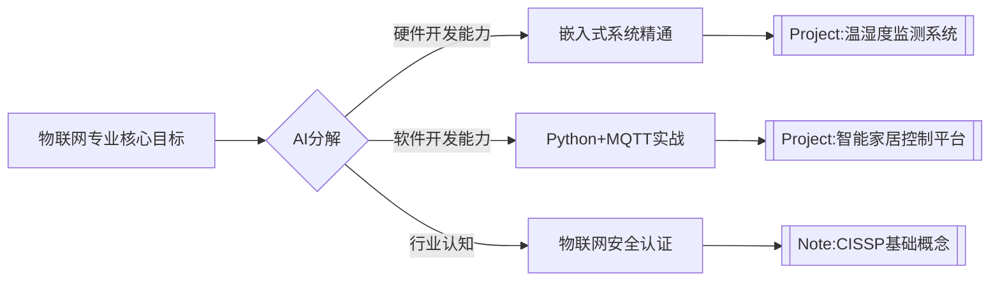
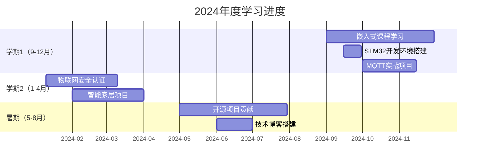
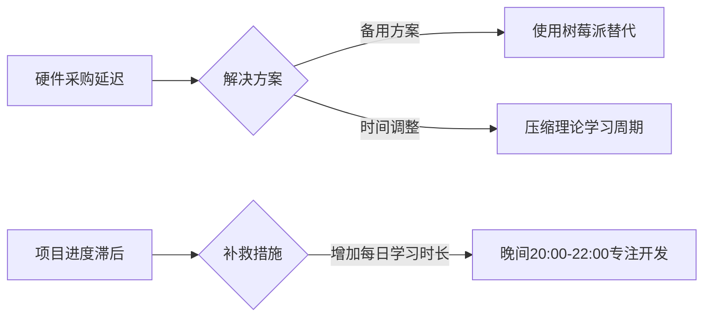

---
tags:
  - Base/Dashboard
---

####  **1. 战略蓝图（Blueprint）**


---

#### **2. 知识框架（MOC）**
**核心学习路径**  

| 领域          | 学习目标                          | 关联笔记/项目                  |
|---------------|-----------------------------------|-------------------------------|
| **硬件开发**  | 掌握STM32与传感器编程             | [[Project:温湿度监测系统]]     |
| **通信协议**  | 理解MQTT、CoAP、LoRaWAN           | [[Note:物联网通信协议对比]]     |
| **云平台**    | 部署AWS IoT Core或阿里云物联网平台 | [[Project:云端数据可视化]]      |
| **安全实践**  | 学习TLS加密与设备认证机制          | [[Note:物联网安全攻防案例]]     |

---

#### **3. 行动计划（Plan）**


---

#### **4. 关键里程碑**
| 时间节点       | 交付物                          | 标签                          |
|---------------|---------------------------------|-------------------------------|
| 2024-12-31    | 温湿度监测系统原型               | #Base/Project #技术栈/嵌入式       |
| 2025-03-31    | 智能家居控制平台演示             | #Base/Project #技术栈/Python       |
| 2025-06-30    | 物联网安全认证证书（如IoT Security Fundamentals） | #Base/Note #技术栈/安全          |

---

####  **5. 资源管理**
- **书籍**（存放于`03-Assets/Books`）：
  - 《嵌入式Linux系统开发实战》
  - 《MQTT权威指南》
- **项目模板**（存放于`04-Templates`）：
  - [[物联网项目开发模板]].md（含硬件清单、代码结构、测试用例）
- **工具链**：
  ```mermaid
  graph LR
      A[硬件] --> B[STM32开发板]
      A --> C[DHT11传感器]
      D[软件] --> E[VSCode+PlatformIO]
      D --> F[Node-RED可视化编程]
  ```

---

#### **6. 风险预案**


---

### **文件存放建议**
- **物理路径**：`01-Dashboard/[[物联网专业大二年度计划]].md`
- **关联笔记**：
  - [[Project:温湿度监测系统]].md（存放于`02-Nodes`）
  - [[Note:MQTT协议实现]].md（技术细节说明）
- **视觉化支持**：
  - 在`Excalidraw`目录创建[[物联网系统架构图]].json，展示项目整体设计

---

### **执行检查点**
- 每月1日：检查项目进度与甘特图对比
- 每季度末：更新[[技能树]].md中的物联网能力雷达图
- 每学期末：将完成项目移入`Archives`目录并生成学习报告
