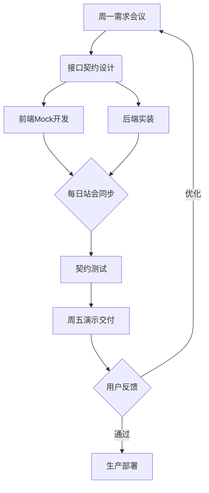

---
tags:
  - 计算机/全栈
  - 计算机/协作开发
快速链接:
  - "[[快速掌握web全栈开发]]"
  - "[[全栈开发roadmap]]"
  - "[[单人全栈项目开发]]"
---
[[快速掌握web全栈开发]]
以下是专门为 2 人全栈团队设计的**高效协作开发流程**，结合「校园论坛」案例的实践说明：

---

### **一、流程总览（敏捷迭代版）**


---

### **二、双人协作细节分解**

#### **1. 需求阶段（周一上午）**
**协作方式**：
- **共同**：用白板梳理用户故事，确定本周核心任务（如「实现帖子评论功能」）
- **前端**：绘制界面原型（Figma 稿）
- **后端**：设计数据模型（ER 图）
```markdown
# 本周任务看板
| 任务             | 前端               | 后端               |
|------------------|--------------------|--------------------|
| 帖子评论功能      | 评论组件开发        | 评论API开发         |
| 学生认证优化      | 认证状态展示        | 学信网接口对接       |
```

---

#### **2. 接口设计（周一下午）**
**协作工具**：Swagger Editor + Git
- **共同**：编写 OpenAPI 文档并提交到 Git 仓库
- **前端**：根据文档生成 Mock 数据
- **后端**：创建接口基础代码框架

```yaml
# 评论接口契约示例
paths:
  /posts/{id}/comments:
    post:
      parameters:
        - name: id
          in: path
          required: true
          type: integer
      requestBody:
        content:
          application/json:
            schema:
              type: object
              properties:
                content:
                  type: string
                  example: "这个帖子很有帮助！"
      responses:
        201:
          content: 
            application/json:
              schema: 
                $ref: '#/components/schemas/Comment'
```

---

#### **3. 并行开发（周二~周四）**
**前端工作流**：
1. 基于 Mock 数据开发 UI 组件
2. 每日提交代码到 `feat/comment-front` 分支
3. 编写 Cypress 组件测试

```javascript
// 前端Mock配置（MSW）
rest.post('/posts/123/comments', (req, res, ctx) => {
  return res(ctx.json({
    id: Date.now(),
    content: req.body.content
  }))
})
```

**后端工作流**：
1. 实现接口业务逻辑
2. 每日提交到 `feat/comment-back` 分支
3. 编写 Jest 单元测试

```typescript
// 评论服务单元测试
test('创建评论应返回201状态码', async () => {
  const mockDto = { content: '测试评论' };
  const response = await request(app)
    .post('/posts/1/comments')
    .send(mockDto);
  expect(response.statusCode).toBe(201);
});
```

---

#### **4. 每日站会（15 分钟/天）**
**沟通要点**：
1. 前端："评论编辑器组件已完成，正在处理表情插入功能"
2. 后端："评论 API 基础功能完成，正在添加敏感词过滤"
3. 共同：协商是否需要调整接口（如增加返回字段）

---

#### **5. 集成测试（周五上午）**
**协作步骤**：
1. 合并各自分支到 `develop`
2. 运行自动化测试流水线
3. 共同进行关键场景测试：
   - 测试用例：用户 A 评论后，用户 B 实时看到更新
   - 工具：使用 ngrok 暴露本地环境进行跨设备测试

```bash
# 启动测试服务器
npm run test:all
# 同时运行
- 前端组件测试 ✓
- 后端接口测试 ✓
- 契约验证测试 ✓
```

---

#### **6. 交付与复盘（周五下午）**
**产出物**：
- 可运行的测试环境地址
- 更新后的 API 文档
- 用户操作录屏（Loom 录制）

**复盘重点**：
- 接口变更次数：本周 2 次字段调整
- 阻塞时间：前端等后端敏感词接口 1 天 → 对策：下次先定义空实现
- 代码冲突：发生 1 次 → 对策：更频繁地合并分支

---

### **三、效率提升工具包**

#### **1. 沟通工具**
- **VSCode Live Share**：实时协同编码
- **Linear**：极简任务管理
- **Miro**：在线白板设计

#### **2. 自动化脚本**
```json
// package.json 示例
{
  "scripts": {
    "start:fe": "vite --port 3000",
    "start:be": "nest start --watch",
    "test:contract": "prism validate ./api.yml",
    "deploy:stage": "docker-compose up --build"
  }
}
```

#### **3. 约定规范**
- **Git 提交规范**：
  ```
  feat(comment): 添加表情支持
  fix(api): 修复评论字数限制校验
  ```
- **分支策略**：
  ```markdown
  main    - 生产环境代码
  develop - 集成测试分支
  feat/*  - 功能开发分支
  hotfix/*- 紧急修复分支
  ```

---

### **四、避坑指南（双人专属）**

#### **1. 接口变更同步**
- 使用**Git Hook**自动通知：
```bash
# pre-commit钩子示例
if git diff --cached --name-only | grep api.yml; then
  echo "检测到接口变更，请通知队友！"
  slack-cli send "#dev-team" "API文档已更新"
fi
```

#### **2. 环境不一致问题**
- 使用**Docker 统一环境**：
```dockerfile
# 前端Dockerfile
FROM node:18
RUN npm install -g pnpm
WORKDIR /app
COPY . .
RUN pnpm install
CMD ["pnpm", "dev"]
```

#### **3. 知识共享**
- 每周五下午进行**交叉 Review**：
  - 前端 Review 后端代码重点：错误处理逻辑
  - 后端 Review 前端代码重点：状态管理方式

---

### **五、典型时间表**


| 时间       | 前端任务                 | 后端任务                 |
|------------|--------------------------|--------------------------|
| 周一上午   | 界面原型设计             | 数据库模型设计           |
| 周一下午   | Mock服务搭建             | 接口基础框架搭建          |
| 周二全天   | 评论组件开发             | 评论API核心逻辑           |
| 周三上午   | 表情功能扩展             | 敏感词过滤实现            |
| 周四全天   | 实时更新功能             | WebSocket服务开发         |
| 周五上午   | 集成测试                 | 压力测试                 |
| 周五下午   | 用户测试录像             | 部署到预发布环境          |

---

**协作心法**：  
1. **每日至少同步 3 次**（晨会+午间同步+下班前进度更新）  
2. **接口就是合同**，变更必须双方签字（Git Commit）  
3. **测试用例是共同财产**，双方都要能看懂对方的测试代码  

通过这种流程，两人团队可以达到**1+1>2**的协作效率，典型功能模块（如评论系统）可在 1 周内完成从设计到交付的全流程。