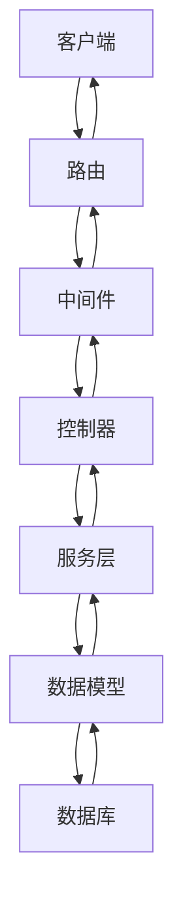

---
tags:
  - 计算机/后端/node
---
好的！我将详细解释现代 Node. Js 后端应用的各个核心组件及其作用，配合架构图和代码示例说明它们如何协同工作。以下是完整的技术架构解析：

---

## 🏗 **后端架构核心组件图解**


---

## 1. **路由（Routes）**
### 核心职责
- **定义 API 端点**：映射 URL 路径到对应的处理逻辑
- **指定 HTTP 方法**：GET/POST/PUT/DELETE 等
- **组织接口版本**：如 `/api/v1/...`

### 代码示例
```javascript
// routes/userRoutes.js
const express = require('express')
const router = express.Router()
const {
  getUsers,
  createUser,
  updateUser
} = require('../controllers/userController')

router.get('/', getUsers)        // GET /api/users
router.post('/', createUser)     // POST /api/users
router.put('/:id', updateUser)   // PUT /api/users/123

module.exports = router
```

### 特点
- **入口点**：所有请求的第一个处理环节
- **最小化逻辑**：仅负责路由分配，不处理业务逻辑
- **支持中间件链**：可串联多个处理函数

---

## 2. **中间件（Middleware）**
### 核心职责
- **请求预处理**：身份验证、请求日志、数据格式化
- **响应后处理**：添加统一响应头、格式化响应数据
- **管道式处理**：多个中间件顺序执行

### 代码示例
```javascript
// middlewares/auth.js
const jwt = require('jsonwebtoken')

const authenticate = (req, res, next) => {
  const token = req.header('Authorization')
  
  if (!token) {
    return res.status(401).json({ error: 'Access denied' })
  }

  try {
    const decoded = jwt.verify(token, 'secret_key')
    req.user = decoded
    next() // 传递到下一个中间件
  } catch (err) {
    res.status(400).json({ error: 'Invalid token' })
  }
}

module.exports = authenticate
```

### 典型应用场景
| 中间件类型 | 功能 |
|-----------|------|
| 身份验证 | JWT 校验、Session 管理 |
| 日志记录 | 记录请求信息、响应时间 |
| 数据验证 | 检查请求体格式 |
| 限流 | 防止 DDoS 攻击 |
| CORS | 处理跨域请求 |

---

## 3. **控制器（Controllers）**
### 核心职责
- **业务逻辑处理**：协调数据操作与响应
- **请求响应管理**：接收请求参数，返回格式化响应
- **错误处理**：捕获并传递异常

### 代码示例
```javascript
// controllers/userController.js
const User = require('../models/User')

exports.getUserProfile = async (req, res) => {
  try {
    const user = await User.findById(req.params.id)
    if (!user) {
      return res.status(404).json({ error: 'User not found' })
    }
    res.json({
      success: true,
      data: user
    })
  } catch (error) {
    res.status(500).json({
      success: false,
      error: 'Server error'
    })
  }
}
```

### 最佳实践
- **保持精简**：单个控制器方法不超过 50 行
- **关注业务流**：`接收输入 → 处理逻辑 → 返回输出`
- **避免直接数据库操作**：通过 Service 层解耦

---

## 4. **服务层（Services）**
### 核心职责
- **复杂业务封装**：实现核心业务逻辑
- **数据库交互**：通过模型进行 CRUD 操作
- **第三方服务集成**：支付、短信、邮件等

### 代码示例
```javascript
// services/userService.js
const User = require('../models/User')

class UserService {
  async createUser(userData) {
    const existingUser = await User.findOne({ email: userData.email })
    if (existingUser) {
      throw new Error('Email already exists')
    }
    return await User.create(userData)
  }

  async updateUser(userId, updates) {
    return await User.findByIdAndUpdate(userId, updates, { new: true })
  }
}

module.exports = new UserService()
```

### 使用场景
```javascript
// 在控制器中调用服务
exports.createUser = async (req, res) => {
  try {
    const newUser = await userService.createUser(req.body)
    res.status(201).json(newUser)
  } catch (error) {
    res.status(400).json({ error: error.message })
  }
}
```

---

## 5. **数据模型（Models）**
### 核心职责
- **定义数据结构**：字段类型、验证规则、索引等
- **封装数据库操作**：提供 CRUD 方法
- **数据关系管理**：关联其他模型

### 代码示例
```javascript
// models/User.js
const mongoose = require('mongoose')

const userSchema = new mongoose.Schema({
  username: {
    type: String,
    required: true,
    unique: true,
    minlength: 3
  },
  email: {
    type: String,
    required: true,
    match: /^\S+@\S+\.\S+$/
  },
  createdAt: {
    type: Date,
    default: Date.now
  }
})

// 添加实例方法
userSchema.methods.getProfile = function() {
  return {
    username: this.username,
    email: this.email,
    memberSince: this.createdAt
  }
}

module.exports = mongoose.model('User', userSchema)
```

### 模型类型
| 模型类型 | 说明 |
|---------|------|
| Schema | 数据结构定义 |
| Instance Methods | 文档级别方法 |
| Static Methods | 模型级别方法 |
| Virtuals | 虚拟字段 |
| Hooks | 生命周期钩子 |

---

## 6. **实用工具（Utils）**
### 核心职责
- **通用功能封装**：日期格式化、加密解密
- **辅助函数**：数据验证、文件操作
- **第三方库封装**：统一 API 调用方式

### 代码示例
```javascript
// utils/emailSender.js
const nodemailer = require('nodemailer')

const transporter = nodemailer.createTransport({
  service: 'Gmail',
  auth: {
    user: process.env.EMAIL_USER,
    pass: process.env.EMAIL_PASS
  }
})

exports.sendWelcomeEmail = async (to) => {
  const mailOptions = {
    from: 'service@example.com',
    to,
    subject: 'Welcome!',
    html: '<h1>Thanks for joining!</h1>'
  }
  
  await transporter.sendMail(mailOptions)
}
```

---

## 7. **配置文件（Config）**
### 核心职责
- **集中管理配置**：数据库连接、API 密钥
- **环境区分**：开发/测试/生产环境配置
- **敏感信息保护**：通过. Env 文件管理

### 代码结构
```
config/
├── index.js       # 主配置
├── dev.env        # 开发环境
├── prod.env       # 生产环境
└── database.js    # 数据库配置
```

### 示例配置
```javascript
// config/database.js
module.exports = {
  development: {
    url: 'mongodb://localhost:27017/dev_db',
    options: {
      useNewUrlParser: true,
      useUnifiedTopology: true
    }
  },
  production: {
    url: process.env.MONGO_URI,
    options: {
      ssl: true,
      replicaSet: 'rs0'
    }
  }
}
```

---

## 🔄 **完整请求处理流程**
1. **客户端发起请求**  
   `GET /api/users/123`

2. **路由匹配**  
   ```javascript
   router.get('/users/:id', getUser)
   ```

3. **中间件处理**  
   ```javascript
   router.get('/users/:id', 
     authMiddleware,   // 身份验证
     cacheMiddleware,  // 缓存检查
     getUser           // 控制器
   )
   ```

4. **控制器处理**  
   ```javascript
   exports.getUser = async (req, res) => {
     const user = await userService.getUser(req.params.id)
     res.json(user)
   }
   ```

5. **服务层操作**  
   ```javascript
   async getUser(userId) {
     return await User.findById(userId)
   }
   ```

6. **模型数据库交互**  
   ```javascript
   User.findById('123').exec()
   ```

7. **返回响应**  
   ```json
   {
     "id": "123",
     "name": "John",
     "email": "john@example.com"
   }
   ```

---

## 🛠 **项目目录结构最佳实践**
```
project/
├── src/
│   ├── config/        # 配置文件
│   ├── controllers/   # 控制器
│   ├── models/        # 数据模型
│   ├── routes/        # 路由定义
│   ├── middlewares/   # 自定义中间件
│   ├── services/      # 业务服务
│   ├── utils/         # 工具函数
│   ├── validators/    # 数据验证
│   └── app.js         # 应用入口
├── tests/             # 测试用例
├── docs/              # 文档
└── package.json
```

---

## 💡 **关键设计原则**
1. **单一职责原则**  
   每个模块/文件只做一件事

2. **分层架构**  
   路由 → 控制器 → 服务 → 模型

3. **依赖倒置**  
   高层模块不依赖低层实现细节

4. **开闭原则**  
   对扩展开放，对修改关闭

5. **DRY 原则**  
   避免重复代码

---

如果需要深入了解某个具体组件（如如何设计更好的服务层），或者想通过实际案例学习各组件如何配合，可以告诉我！我们可以选择一个具体场景进行深入探讨。