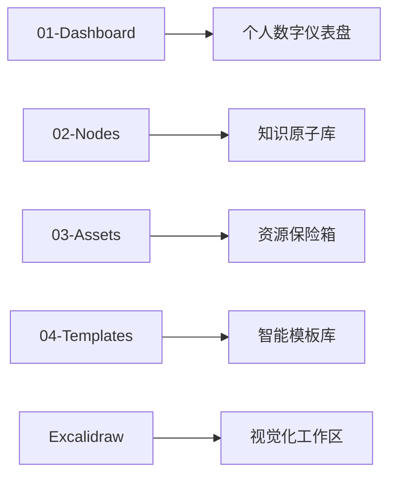
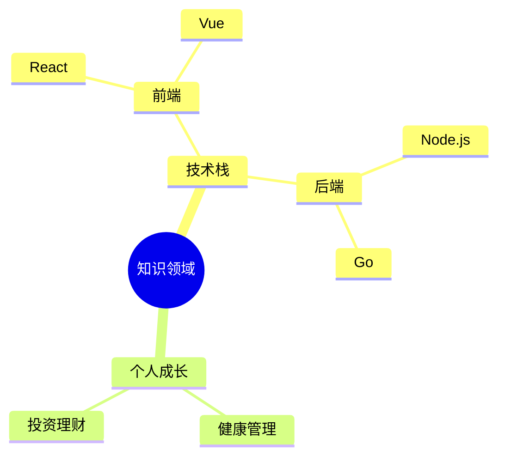
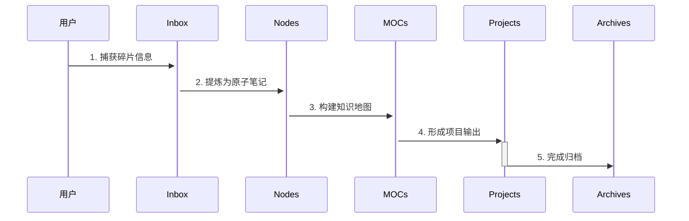

# 知识仓库使用手册 V2.0

 <!-- 建议替换为实际示意图 -->

## 设计理念
**极简主义 × 模块化设计**  
- 🧠 认知友好：采用「目录锚点+标签维度」双轨制，降低记忆负担
- 🧩 MECE原则：所有分类做到相互独立、完全穷尽
- 🚀 敏捷扩展：通过标签森林实现无限维度的知识组织

## 核心架构
### 文件体系（物理结构）


### 标签体系（逻辑结构）
**基础分类树（唯一性保证）**


**领域扩展林（多维度标记）**


## 工作流程
### 标准操作流


### 每日维护清单
1. `07:00` 清理Inbox（保留<24小时内容）
2. `19:00` 更新进行中的#Project笔记
3. `22:00` 检查未关联的#Note

## 快速入门
### 新手三部曲
1. **创建知识原子**
   ```bash
   # 使用模板新建Note
   ⌘/Ctrl + N → 选择"Atomic Note" → 自动添加#Note标签
   ```
   
2. **构建知识关联**
   ```markdown
   [[React生命周期]] ← 在MOC笔记中链接相关原子笔记
   ```

3. **生成可视化图谱**
   ```javascript
   // 在MOC笔记中插入：
   ```mermaid
   graph TD
      MOC --> Note1
      MOC --> Note2
   ```
   ```

## 最佳实践
### 标签使用规范
| 场景   | 基础标签            | 扩展标签       |
| ---- | --------------- | ---------- |
| 学习笔记 | #Base/Note      | Tech/前端    |
| 项目规划 | #Base/Project   | Status/进行中 |
| 战略思考 | #Base/Blueprint | Priority/高 |

### 目录维护规则
- `03-Assets` 自动分类规则：
  ```regex
  /\.(pdf|epub)$/    → /Books
  /^Clip_/           → /WebClips
  /\.(ai|psd)$/      → /Designs
  ```

---

⚠️ **注意事项**  
1. 禁止在02-Nodes目录中存放非Markdown文件  
2. Base标签必须且只能选择一个  
3. 每周日执行"孤儿笔记"检查（无链接的#Note）

🛠️ **故障排查**  
```markdown
Q: 找不到相关笔记？  
A: 尝试组合搜索：`tag:#Note + "关键词" path:02-Nodes`

Q: 标签显示混乱？  
A: 使用Tag Wrangler插件整理标签层级
```

这个版本通过场景化指引、可视化表达和规范约束，使手册成为真正的「开箱即用」指南。需要补充插件配置细节吗？
