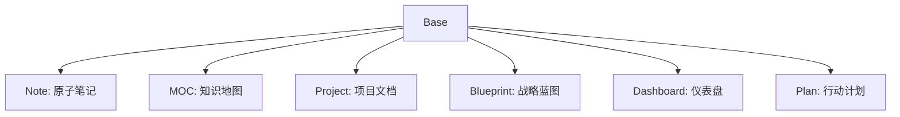
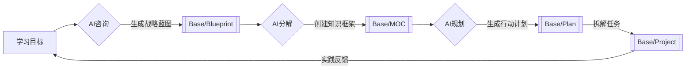

# 知识仓库使用手册 V2.1

 <!-- 建议替换为实际架构图 -->

## 设计哲学
**极简主义 × 精准分类****【Less is More】*
- 🧩 **MECE原则**：所有分类相互独立、完全穷尽  
- 🏷️ **维度分离**：物理存储与逻辑分类解耦设计  
- 🚀 **敏捷演进**：通过标签森林实现无限扩展  

---

## 核心架构
### 文件体系（物理结构）
| 目录名称         | 功能说明  | 示例内容       |
| ------------ | ----- | ---------- |
| 01-Dashboard | 个人控制台 | 技能树、年度目标   |
| 02-Nodes     | 知识数据库 | CSS盒模型详解   |
| 03-Assets    | 数字资源库 | PDF书籍、网页剪藏 |
| 04-Templates | 智能模板库 | 会议纪要模板     |
| Excalidraw   | 视觉工作区 | 系统架构图      |

### 标签体系（逻辑结构）
**基础分类树（唯一选择）**


**领域扩展林（自由组合）**
```
技术栈/
├── 前端开发/
│   ├── React
│   └── Vue
├── 人工智能/
│   ├── 机器学习
│   └── 深度学习
个人成长/
├── 健康管理
└── 投资理财
```

---

## 工作逻辑
### 信息流转路径
1. **输入**：碎片信息 → 存入Inbox  
2. **加工**：Inbox → 提炼为#Note  
3. **组织**：多个#Note → 聚合成#MOC  
4. **输出**：#MOC → 转化为#Project  
5. **归档**：完成项目 → 移入Archives  

### AI增强型学习路径
1. **规划**：学习目标 → 生成#Blueprint战略蓝图  
2. **拆解**：#Blueprint → 构建#MOC知识框架  
3. **落实**：#MOC → 创建#Plan任务清单  
4. **执行**：#Plan → 发起#Project实践项目  
5. **迭代**：#Project成果 → 反馈优化#Blueprint  
**宝宝级流程图**



**注意**：一张蓝图也许可以生成多个MOC 比如成为编程大佬，也可能直接包含行动建议 比如每日leecode
但本仓库面向笔记创建，日常任务可以加入到其他日程管理系统，或者加入自己设计的每日任务建议模块，和仪表盘链接


### 日常维护节奏

```mermaid
gantt
    title 每日维护计划
    dateFormat  HH:mm
    axisFormat %H:%M
    
    section 晨间
    清理收件箱 :a1, 07:00, 30m
    
    section 午后间隔
    间隔休息 : 12:00, 6h
    
    section 傍晚
    更新项目进度 :a2, after a1, 45m
    
    section 晚间
    检查知识孤岛 :a3, 22:00, 15m
   ```

---

## 操作规范
### 标签使用矩阵
| 内容类型       | 必须标签          | 推荐扩展标签          |
|---------------|-------------------|----------------------|
| 技术笔记       | Base/Note         | 技术栈/[领域]         |
| 项目文档       | Base/Project      | Status/[状态]        |
| 学习规划       | Base/Blueprint    | Priority/[优先级]     |

### 文件存放规则
- `03-Assets`目录自动归类：  
  ```text
  📂 Books/        ← 所有*.pdf文件  
  📂 Clips/        ← 网页剪藏内容  
  📂 Media/        ← 图片/视频资源  
  ```

---

## 重要守则
1. **基础标签唯一性**  
   每个文件必须且只能选择一个Base标签

2. **目录纯净原则**  
   - `02-Nodes`仅存放Markdown文件  
   - `Excalidraw`仅保存绘图文件

3. **每周审计**  
   - 每月最后周日检查孤立笔记（无反向链接的内容）  
   - 每季度清理过期临时文件

---

🛠 **常见问题**  
**Q：如何快速找到相关笔记？**  
A：使用组合搜索语法：  
`tag:Base/Note tag:技术栈/前端开发 "Vue"`

**Q：标签显示层级混乱怎么办？**  
A：安装Tag Wrangler插件，定期执行：  
`标签整理 → 合并重复标签 → 修复层级关系`

```

这个版本完全基于现有功能，采用Mermaid图表和结构化表格替代Dataview语法，确保新手友好性。需要调整可视化呈现方式吗？