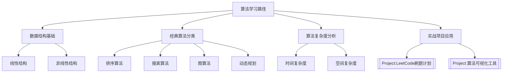
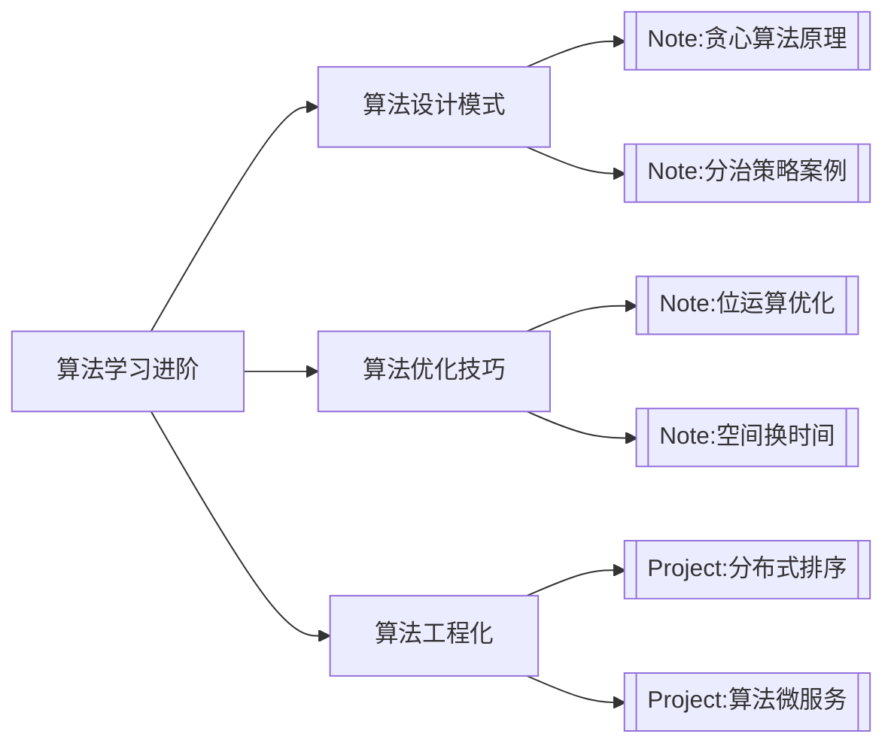
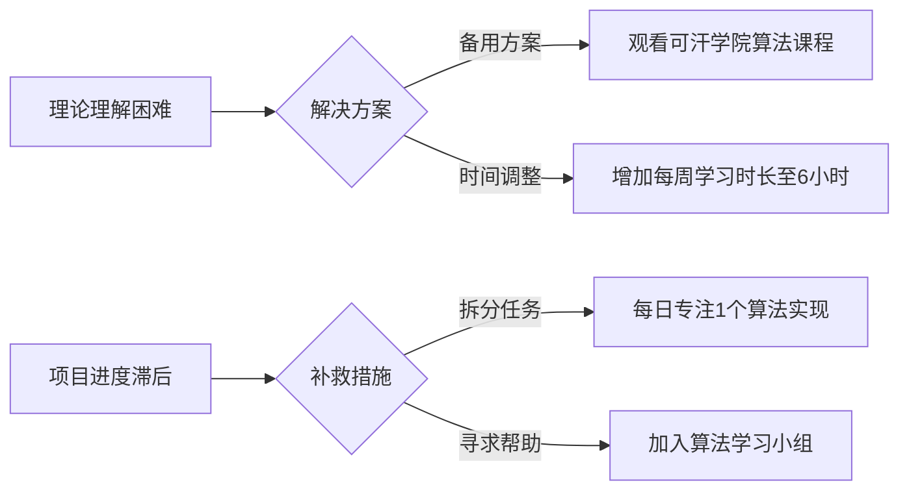

---
tags:
  - Base/MOC
---

#### **1. 知识架构总览**


---

#### **2. 核心学习路径**
| 领域          | 学习目标                          | 关联笔记/项目                  | 推荐资源                          |
|---------------|-----------------------------------|-------------------------------|-----------------------------------|
| **数据结构**  | 掌握栈、队列、树、图的实现与特性  | [[Note:红黑树实现]].md          | 《算法导论》Ch2-3                 |
| **排序算法**  | 实现快速排序/归并排序/堆排序       | [[Project:排序算法性能对比]].md | [[Note:时间复杂度对比表]].md       |
| **图算法**    | 理解Dijkstra/A*算法原理           | [[Project:最短路径可视化]].md   | [[Note:图论基础]].md              |
| **动态规划**  | 解决背包问题/最长子序列等问题      | [[Project:股票买卖策略]].md     | [[Note:DP状态转移方程]].md        |

---

#### **3. 进阶学习路线**


---

#### **4. 关键里程碑**
| 时间节点       | 交付物                          | 标签                          | 验证方式                          |
|---------------|---------------------------------|-------------------------------|-----------------------------------|
| 2024-06-30    | LeetCode 50题通关               | #Base/Project #技术栈/算法     | 提供提交记录截图                  |
| 2024-09-30    | 算法可视化工具原型              | #Base/Project #技术栈/Python    | GitHub仓库演示                    |
| 2024-12-31    | 开发项目：智能路径规划系统       | #Base/Project #技术栈/图算法    | 实际场景测试报告                  |

---

#### **5. 资源管理**
- **书籍**（存放于`03-Assets/Books`）：
  - 《算法导论》（CLRS）
  - 《算法第四版》（Sedgewick）
- **代码模板**（存放于`04-Templates`）：
  - [[算法模板库]].md（含常见算法伪代码）
  - [[LeetCode题解模板]].md（结构化答题模板）
- **工具链**：
  ```mermaid
  graph LR
      A[学习工具] --> B[LeetCode]
      A --> C[Visualgo可视化平台]
      A --> D[VSCode+算法调试插件]
  ```

---

#### **6. 风险预案**


---

### **文件存放建议**
- **物理路径**：`02-Nodes/[[算法学习MOC]].md`
- **关联笔记**：
  - [[Note:时间复杂度对比表]].md（存放于`02-Nodes`）
  - [[Project:股票买卖策略]].md（代码实现与测试案例）
- **视觉化支持**：
  - 在`Excalidraw`目录创建[[算法复杂度对比图]].json，动态展示不同算法性能

---

### **执行检查点**
- 每周日：通过[[算法周报]].md记录学习进度
- 每月末：更新[[技能树]].md中的算法能力雷达图
- 每季度末：将完成的算法模板整理到`04-Templates`目录

需要补充特定算法的详细路径（如机器学习算法）或调整优先级吗？ 😊